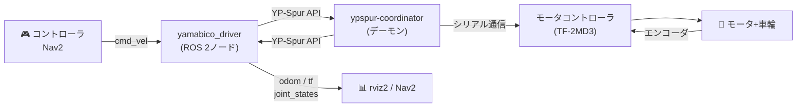

# 山彦ロボットの扱い方

## ROS 2版

<div class="mt-4 text-lg opacity-70">
Docker不要で動かせるようになりました
</div>

<div class="abs-br m-6 text-sm opacity-40">
筑波大学 知能ロボット研究室
</div>

---

# アウトライン

<v-clicks>

- **旧環境(ROS 1)との違い** — なぜDockerが不要になったのか
- **環境構築** — YP-Spur + ROS 2ドライバのセットアップ
- **山彦を動かしてみる** — コントローラ / コマンドラインで操作

</v-clicks>

---

## layout: section

# 旧環境(ROS 1)との違い

---

# ROS 1時代の構成

<div class="grid grid-cols-2 gap-12">
<div>

### なぜDockerが必要だった？

<v-clicks>

- Ubuntu 22.04 に **ROS 1が入らない**
- Docker内に Ubuntu 20.04 + ROS 1 を構築
- 毎回コンテナを起動する必要があった

</v-clicks>

</div>
<div>

```
ホストPC (Ubuntu 22.04)
│
└─ Docker (Ubuntu 20.04)
   ├─ ROS 1 (Noetic)
   ├─ ypspur_ros
   └─ catkin_make
```

<div v-click class="mt-4 p-3 bg-red-50 border-l-4 border-red-400 rounded-r text-sm">

**課題**: コンテナ起動・USB設定が毎回必要で面倒

</div>

</div>
</div>

---

# ROS 2版の構成

<div class="grid grid-cols-2 gap-12">
<div>

### Docker不要に！

<v-clicks>

- ROS 2 は **Ubuntu 22.04/24.04 にネイティブ対応**
- YP-Spur はそのままインストール可能
- yamabico_driver で ROS 2 と橋渡し

</v-clicks>

</div>
<div>

```
ホストPC (Ubuntu 22.04 / 24.04)
├─ ROS 2 (Humble / Jazzy)
├─ YP-Spur
├─ yamabico_driver
└─ colcon build
```

<div v-click class="mt-4 p-3 bg-green-50 border-l-4 border-green-500 rounded-r text-sm">

**メリット**: すぐ使える / Nav2等と直接連携

</div>

</div>
</div>

---

# ソフトウェアの全体像



<v-click>

<div class="mt-4 p-4 bg-blue-50 border-l-4 border-blue-500 rounded-r">

**yamabico_driver** = ROS 2トピック ↔ YP-Spur API の変換レイヤー

</div>

</v-click>

---

# ROS 1 → ROS 2 対応表

| やりたいこと | ROS 1 (Docker内)                       | ROS 2                              |
| :----------- | :------------------------------------- | :--------------------------------- |
| マスター起動 | `roscore`                              | **不要**                           |
| ドライバ起動 | `roslaunch ypspur_ros beego.launch`    | `ros2 launch yamabico_driver ...`  |
| コントローラ | `roslaunch yamasemi_ex joypad.launch`  | `ros2 launch teleop_twist_joy ...` |
| 速度指令送信 | `rostopic pub /ypspur_ros/cmd_vel ...` | `ros2 topic pub /cmd_vel ...`      |
| トピック一覧 | `rostopic list`                        | `ros2 topic list`                  |
| 可視化       | `rviz`                                 | `rviz2`                            |

---

## layout: section

# 環境構築

---

# Step 1: ROS 2 のインストール

Ubuntuバージョンに合わせて選択

<div class="grid grid-cols-2 gap-8 mt-4">
<div class="p-6 bg-blue-50 rounded-xl text-center">

### Ubuntu 22.04

**ROS 2 Humble**

```bash
sudo apt install ros-humble-desktop
```

</div>
<div class="p-6 bg-purple-50 rounded-xl text-center">

### Ubuntu 24.04

**ROS 2 Jazzy**

```bash
sudo apt install ros-jazzy-desktop
```

</div>
</div>

<v-click>

```bash
# .bashrc に追加（Humbleの場合）
echo "source /opt/ros/humble/setup.bash" >> ~/.bashrc
source ~/.bashrc
```

</v-click>

---

# Step 2: YP-Spur のインストール

```bash
# 依存パッケージ
sudo apt install cmake build-essential libyaml-dev

# ソースからビルド
cd ~
git clone https://github.com/openspur/yp-spur.git
cd yp-spur
mkdir build && cd build
cmake ..
make
sudo make install
sudo ldconfig
```

<v-click>

<div class="mt-2 p-4 bg-amber-50 border-l-4 border-amber-500 rounded-r">

**⚠ Ubuntu 22.04/24.04 の場合**（カーネル 6.8+）

`src/serial.c` の修正が必要な場合がある:

```c
// 533行目付近: コメントアウト
// serial_flush_out();
```

参考: openspur/yp-spur#245

</div>

</v-click>

---

# Step 3: ビルド

```bash
# ワークスペース作成
mkdir -p ~/ros2_ws/src
cd ~/ros2_ws/src

# yamabico_driver を配置（USBやgit cloneで持ってくる）
cp -r /path/to/yamabico_driver .

# ビルド
cd ~/ros2_ws
colcon build --symlink-install --packages-select yamabico_driver

# 環境をロード
echo "source ~/ros2_ws/install/setup.bash" >> ~/.bashrc
source ~/.bashrc
```

---

# Step 4: パラメータファイルの確認

<div class="grid grid-cols-2 gap-8">
<div>

### ロボット固有の `.param` を探す

```bash
# 既存ワークスペースから探す
find ~/yamasemi_ws -name "*.param"
find /root -name "*.param"
```

見つけたら `yamabico_driver/config/` にコピー

</div>
<div>

### パラメータの中身

```ini
VERSION 4
COUNT_REV 400      # エンコーダ
VOLT 12            # 電源電圧
GEAR 75            # ギア比
RADIUS[0] 0.04     # 左車輪半径 [m]
RADIUS[1] -0.04    # 右車輪半径 [m]
TREAD 0.200        # 車輪間距離 [m]
```

<div class="mt-2 text-sm opacity-60">

Beego/Speego: 12V / M1: 24V

</div>

</div>
</div>

---

# Step 5: デバイスの設定

```bash
# モータコントローラのデバイスを確認
ls /dev/ttyACM* /dev/ttyUSB*
```

<div class="grid grid-cols-2 gap-8 mt-4">
<div>

### スクリプトのデバイスパスを修正

```sh
# scripts/ypspur_coordinator_bridge
DEVICE="/dev/ttyACM0"
```

</div>
<div>

### 権限の設定

```bash
# 一時的
sudo chmod 666 /dev/ttyACM0

# 恒久的（要再ログイン）
sudo usermod -aG dialout $USER
```

</div>
</div>

---

## layout: section

# 山彦を動かしてみる

---

## layout: two-cols-header

# 1. コントローラで動かす

::left::

### ターミナル 1: ドライバ起動

```bash
ros2 launch yamabico_driver \
  bringup_launch.py
```

### ターミナル 2: コントローラ

```bash
sudo apt install \
  ros-humble-joy \
  ros-humble-teleop-twist-joy

ros2 launch teleop_twist_joy \
  teleop-launch.py
```

::right::

<div class="ml-4">

### 操作方法

<div class="mt-4 p-4 bg-gray-50 rounded-xl text-center">

**左スティック** = 並進速度 v_x

**右スティック** = 回転角速度 ω_z

</div>

<div class="mt-4 p-3 bg-amber-50 border-l-4 border-amber-400 rounded-r text-sm">

最大 v_x=0.5, ω_z=0.5 くらいまで

</div>

</div>

---

# 2. コマンドラインで動かす

### ターミナル 1: ドライバ起動

```bash
ros2 launch yamabico_driver bringup_launch.py
```

### ターミナル 2: 速度指令を送信

```bash
# v_x=0.1 [m/s], ω_z=0.2 [rad/s] を 10Hz で送信
ros2 topic pub /cmd_vel geometry_msgs/msg/Twist \
  "{linear: {x: 0.1}, angular: {z: 0.2}}" --rate 10
```

<v-click>

```bash
# 停止
ros2 topic pub /cmd_vel geometry_msgs/msg/Twist \
  "{linear: {x: 0.0}, angular: {z: 0.0}}" --once
```

</v-click>

---

# 動作確認コマンド

<div class="grid grid-cols-2 gap-6">

<div>

```bash
# トピック一覧
ros2 topic list

# オドメトリ確認
ros2 topic echo /odom

# 速度指令の確認
ros2 topic echo /cmd_vel
```

</div>
<div>

```bash
# 車輪の状態
ros2 topic echo /joint_states

# 可視化
rviz2
```

</div>
</div>

---

# 課題

<div class="mt-8 text-center">

### v_x = 0.2 [m/s] で旋回半径 1.0 m で走らせる

</div>

<v-click>

<div class="mt-8 grid grid-cols-2 gap-8 items-center">
<div class="text-center">

$$v_x = r \cdot \omega_z$$

$$\omega_z = \frac{v_x}{r} = \frac{0.2}{1.0} = 0.2 \text{ [rad/s]}$$

</div>
<div>

```bash
ros2 topic pub /cmd_vel \
  geometry_msgs/msg/Twist \
  "{linear: {x: 0.2}, angular: {z: 0.2}}" \
  --rate 10
```

</div>
</div>

</v-click>

---

# トラブルシューティング

| 症状                     | 原因               | 対処                              |
| :----------------------- | :----------------- | :-------------------------------- |
| coordinator が起動しない | デバイス未接続     | `ls /dev/ttyACM*` で確認          |
| `Spur_init() failed`     | coordinator 未起動 | coordinator を先に起動            |
| 位置がおかしい           | param が違う       | 正しいロボットの param に差し替え |
| 接続後すぐ切れる         | カーネル問題       | `serial.c` パッチ適用             |

---

layout: center
class: text-center

---

# まとめ

<div class="grid grid-cols-3 gap-6 mt-8 text-sm">
<div class="p-6 bg-blue-50 rounded-xl">

### Docker不要

ROS 2は Ubuntu 22.04/24.04 に
ネイティブ対応

</div>
<div class="p-6 bg-green-50 rounded-xl">

### 手順はシンプル

YP-Spur インストール →
ドライバビルド → launch

</div>
<div class="p-6 bg-purple-50 rounded-xl">

### ROS 1と基本は同じ

cmd_vel で速度指令
odom でオドメトリ

</div>
</div>
